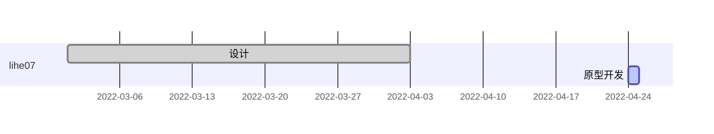

# LabelWeb

标注识别系统的桌面端界面

## 时间进度

```mermaid
gantt
dateFormat YYYY-MM-DD
section lihe07
设计: done, design, 2022-03-01, 2022-04-03
原型开发: active, prototype, 2022-04-24, 2022-04-25
```

## 开发、编译、部署

安装依赖：`npm i`

打开开发服务器：`npm run dev`

编译：`npm run build`

