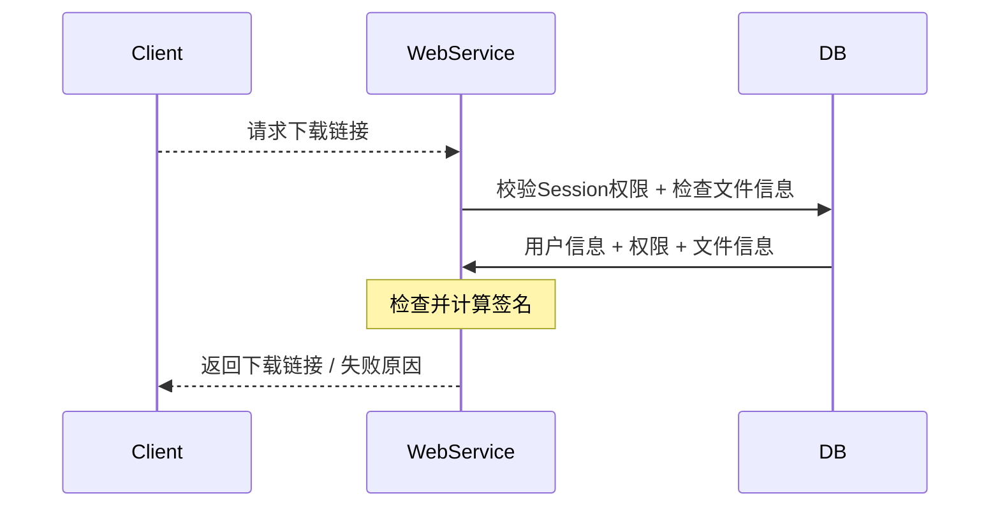
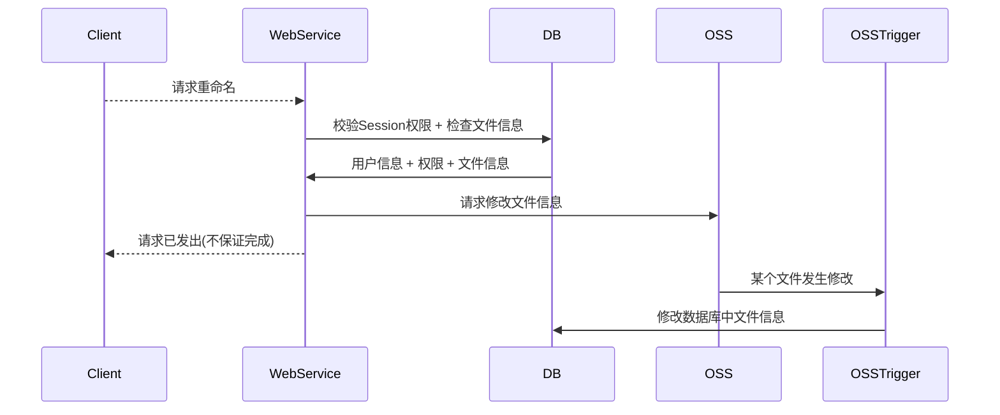
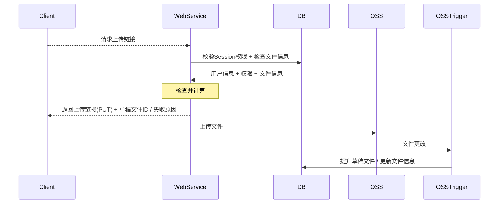

# StorageApi

关联阿里云OSS和数据库的云函数

## 结构

- [`./src/`](./src/README.md): Source Code
- `/Cargo.toml`: Project Configuration

## 流程分析

访问 / 下载数据

修改数据：重命名

替换数据：上传新文件（PUT）

## 配置及部署指南

> 该项目需与`OSSTrigger`配合部署

- 该项目针对阿里云Serverless开发，依赖于阿里云的**OSS API**
- 新建云函数时，选择`CustomRuntime -> Rust`
- 进入工作台，将已有代码全部删除
- 在Linux环境下运行`cargo build --release`，将生成的可执行文件重命名为`server`，并上传至云函数根目录
- 点击保存并部署

## 接口文档

- [ ] **GET** `/files/<id>`：获取一个文件的映射信息

  权限：必须登录，此外无特殊限制

