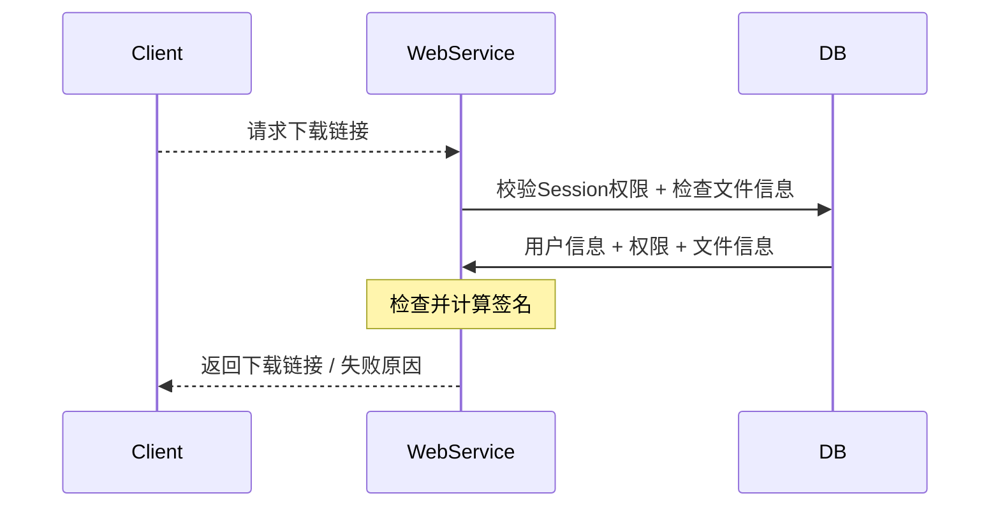
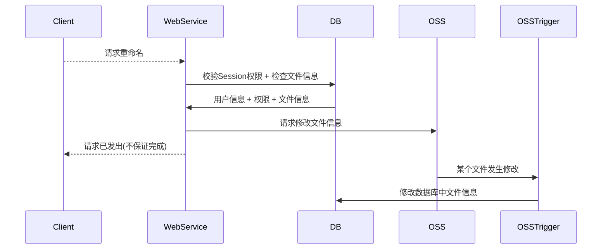
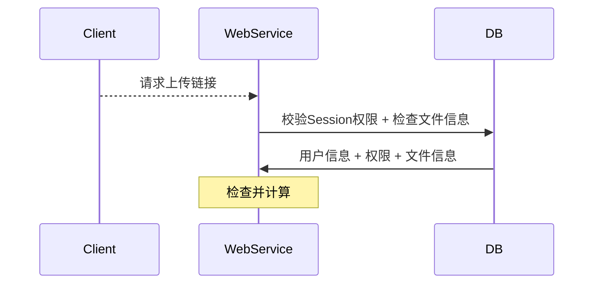

# StorageApi

关联阿里云OSS和数据库的云函数，包含两部分

## 结构

- WebService: 提供对外接口
- OSSTrigger: 在文件修改后，改动数据库（如上传 / 删除 / 重命名）

## 流程分析

访问 / 下载数据

```mermaid
sequenceDiagram
	Client -->> WebService:请求下载链接
	WebService ->> DB: 校验Session权限 + 检查文件信息
	DB ->> WebService: 用户信息 + 权限 + 文件信息
	note over WebService: 检查并计算签名
	WebService -->> Client: 返回下载链接 / 失败原因 
	
```

修改数据：重命名

```mermaid
sequenceDiagram
	Client -->> WebService: 请求重命名
    WebService ->> DB: 校验Session权限 + 检查文件信息
    DB ->> WebService: 用户信息 + 权限 + 文件信息
    WebService ->> OSS: 请求修改文件信息
    WebService -->> Client: 请求已发出(不保证完成)
    OSS ->> OSSTrigger: 某个文件发生修改
    OSSTrigger ->> DB: 修改数据库中文件信息
```

修改数据：上传新文件

```mermaid
sequenceDiagram
	Client -->> WebService: 请求上传链接
	WebService ->> DB: 校验Session权限 + 检查文件信息
	DB ->> WebService: 用户信息 + 权限 + 文件信息
	note over WebService: 检查并计算

```

